# 80251 ESC Base on AI8051U

* [AM32](https://github.com/am32-firmware/AM32) 
* [ESC_Config_Tool](https://am32.ca/downloads) 
* [Bootloader](https://github.com/Icey7122/AM32_Bootloader_AI8051U) 

## Introduction
The AM32 firmware has been ported to the 80251 platform, and the controller has chosen as AI8051U. It can be compiled on Keil C251. At the same time, the bootloader program has been ported, and tool of Esc_Config_Tool_1_82_WIN can be used to configure and upgrade firmware for ESC.

## Hardware

### MCU
The resources of MCU([datasheet](https://www.stcaimcu.com/data/download/Datasheet/AI8051U.pdf)) are shown in the following figure,You can see that it has many peripheral resources.For more information, you can refer to the [STC](https://www.stcai.com/) 

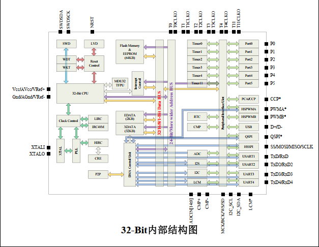

### MCU Pins Diagram
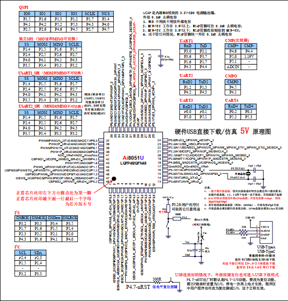

Using PWMA to output 3 sets of complementary PWM for driving MOSFEET, Using PWMB for capturing external throttle signals, Using ADC to sample voltage and current, for low voltage protection and over current protection(But I'm not done yet). Using internal OPA and BEMF to estimate rotor position. TMR0 and TMR1 is used to calculate commutation time and motor timing.TMR2 is used for the serial port. TMR3 and TMR11 are used for the delay function (in fact, only one is needed). TMR4 is used to complete some periodic tasks.

### PINS
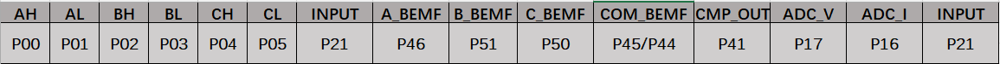

AH AL BH BL CH CL:  PWMA outputs; 
INPUT: PWMB used to capture external throttle signals; 
A_BEMF: A-Phase BEMF, connect to P46; 
B_BEMF: B-Phase BEMF, connect to P51; 
C_BEMF: C-Phase BEMF, connect to P50; 
CC_BEMF: Neutral point BEMF, connect to P45/P44(Note that for this mcu, P45 and P44 are the same pins); 
ADC_V: Voltage sampling channel; 
ADC_I: Current sampling channel; 
 
In order to unify the interrupt entry of OPA, the outputs of OPA are merged into P41, Using pin interrupts of P41 for zero crossing comparison processing.

P30 and P31 are used to download bootloader  via STC-LINK1, UART or internal USB. 

For detailed information, please refer to the [schematic diagram](docs/sch.pdf), **NOTE: The current firmware does not support current sampling and adc sampling.**

## Config

### Flashing BootLoader
1. For empty chips, BootLoader needs to be flashed via STC-LINK1, USB or internal USB, Connect according to the diagram below.

   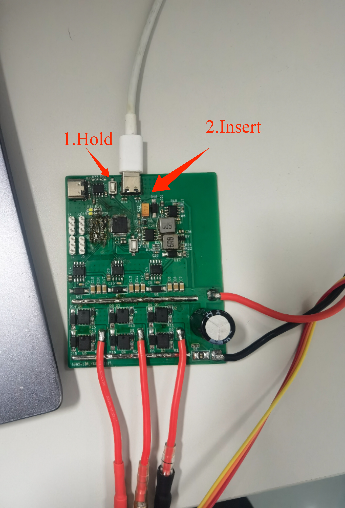
   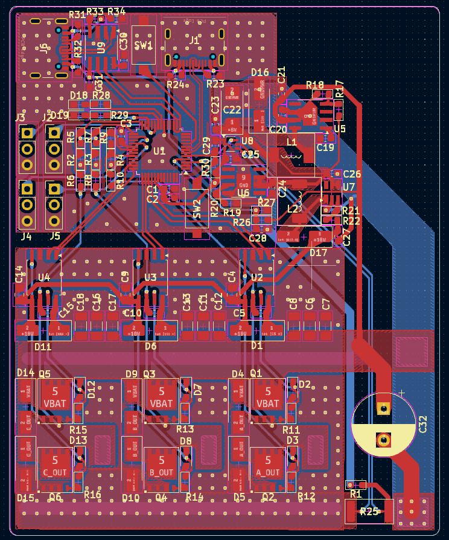

2. Open the [Bootloader project](https://github.com/Icey7122/AM32_Bootloader_AI8051U) using AIapp-ISP and download it directly after compilation.

    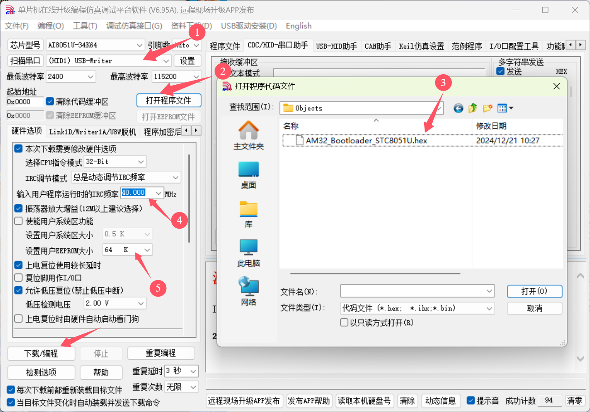

3. Use a one-wire serial port(You can connect the RX and TX of the USB to serial chip,such as CH340, together and then connect them to the board) to connect to ESC and use tools to configure and update firmware. I used CH340 to perfom, and the wiring is shown in the following figure.

    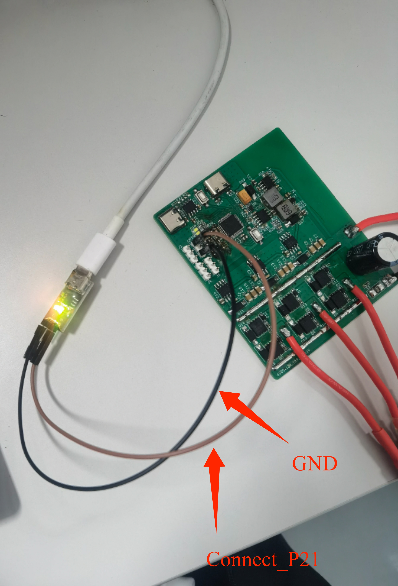

    If the Bootloader is burned correctly, Open the configuration tool ***Esc_Config_Tool_1_82_WIN.exe*** and power on the ESC. Follow the steps in the following figure to click. When connecting for the first time, *'No EEprom'* will be displayed!
    
    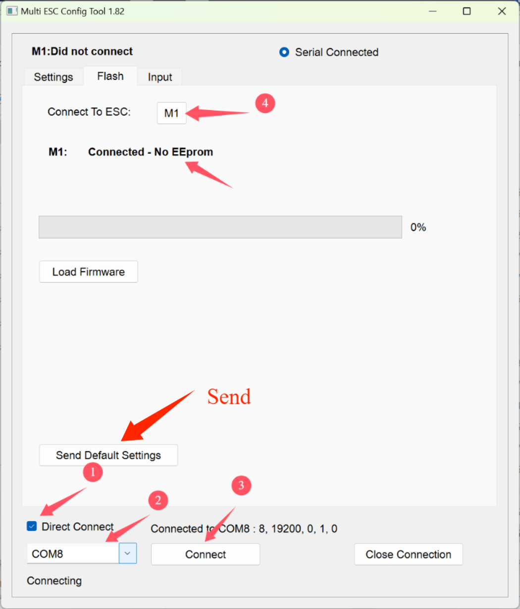

    Directly click on ***Send Default Settings*** below to burn the default values. After successful burning, power on again. Connect again and click ***M1***. The default parameters we just burned will be displayed.

    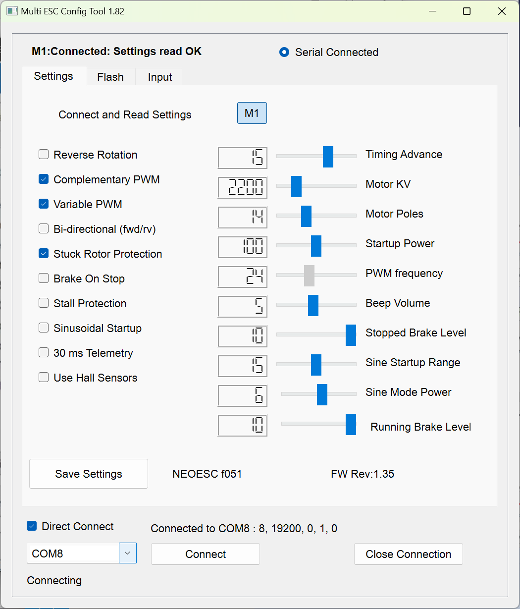

4. Flashing firmware and configurations 
    The firmware can be compiled using Keil C251, and the compiled firmware is in the ***\Objects*** folder.

    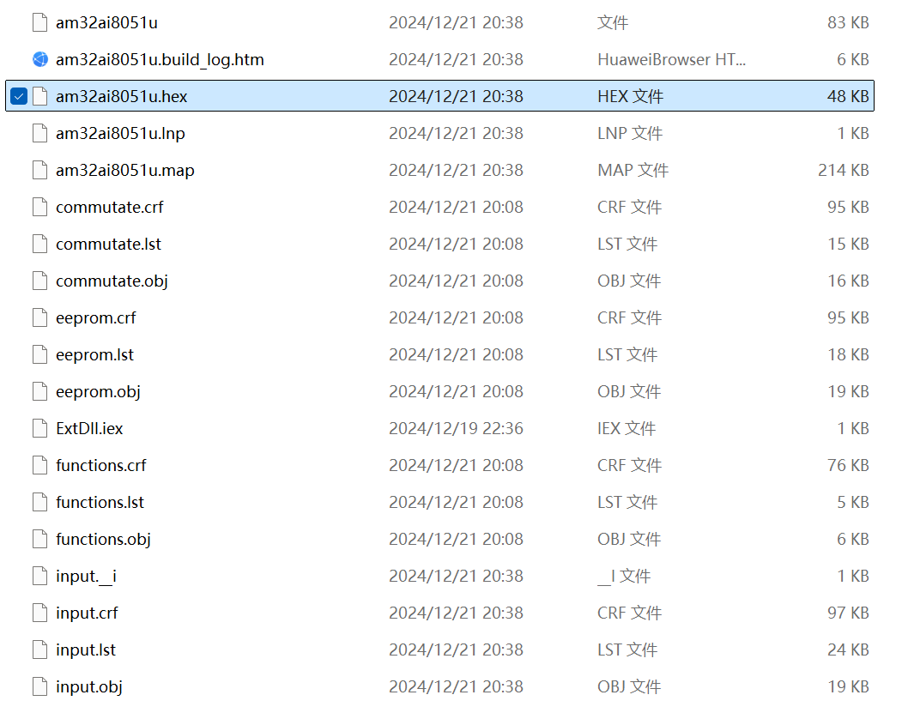

    Open the HEX file with a text editor.I prefer to use VScode.To support HEX file editing, you need to install the ***Hex Editor or Intel HEX format*** plug-in. The plug-in can be installed in the extension market. After installation, open the HEX file.

    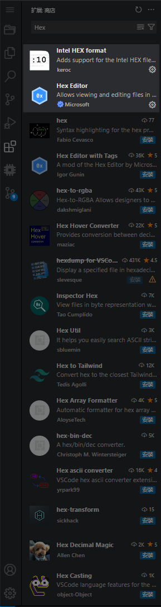

    In this HEX file, please pay attention to the first line. 
    :03**0000**00023E58**65** 
    You should change the value of the **0000** to **1000** and the value of the **65** to **55**. Then save the file. 
    :03**1000**00023E58**55** 
    Note that the value of the **0000** is the starting address of the program, and the value of the **65** is the checksum. The value of the **1000** is the starting address of the program after the bootloader is burned. The value of the **55** is the new checksum. The starting address of the program after the bootloader is burned is 0x1000, so the value of the **0000** is changed to **1000**. The checksum is calculated by adding all the data in the line except the starting colon and the checksum itself, and then taking the two's complement of the last byte of the sum. The value of the **65** is changed to **55**. The specific calculation method can be found in the [link](https://en.wikipedia.org/wiki/Intel_HEX).
    If you use VScode with the plug-in, you can directly click on the **address value** to modify it, and the plug-in may automatically calculate the new checksum.

    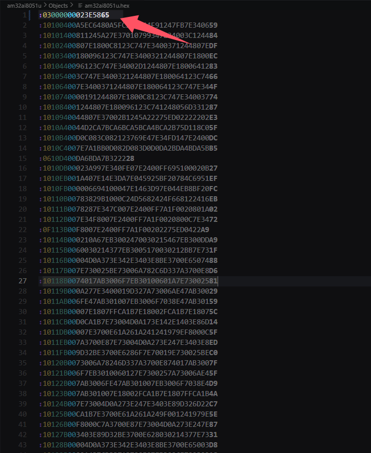
    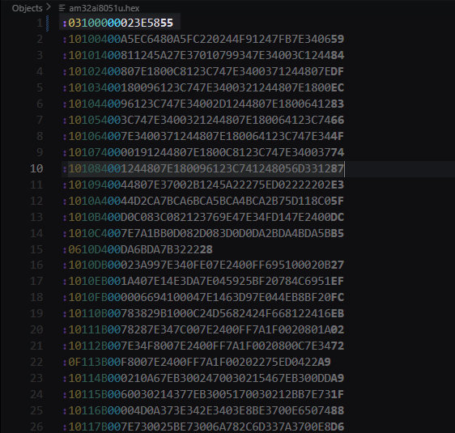
   
   Returning to the FLASH interface of the tool, we click on ***Load Firmware***, select the firmware we just modified, and the ***FLash Firmware*** button will pop up. Click to start updating the program. 

    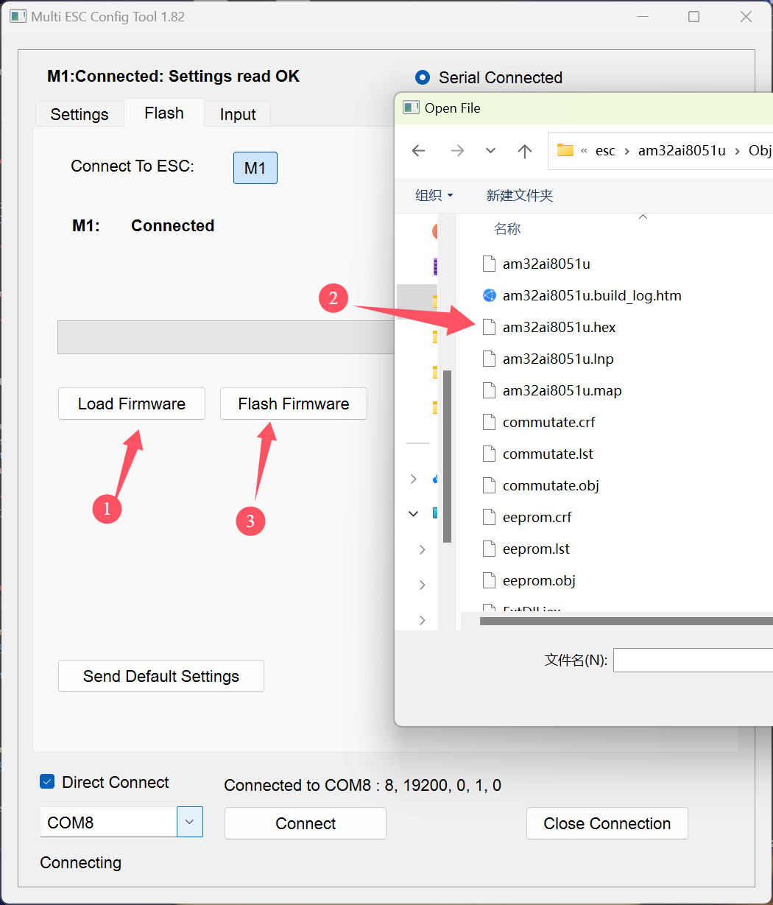

    After the update is completed, power on again and connect ESC again to configure ESC. The specific meaning of configuration values can be found in the following [links](https://github.com/AlkaMotors/AM32-MultiRotor-ESC-firmware/wiki/ESC-Settings-Explained).

    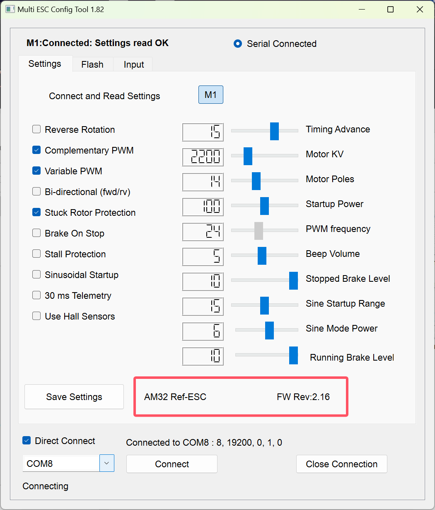

## Test

The version I ported is V2.16, which supports signals such as dshot300, dshot600, and PWM.(But for some reason, I only implemented PWM, dshot can't be used).

## Reference
* [AM32](https://github.com/am32-firmware/AM32)
* [RISC-V AM32](https://github.com/TianpeiLee/AM32)

